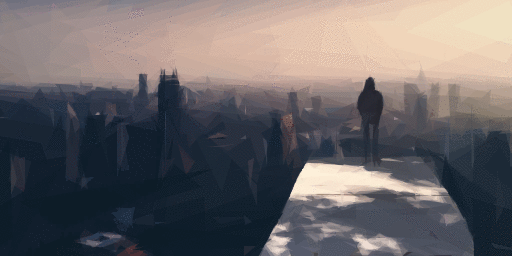
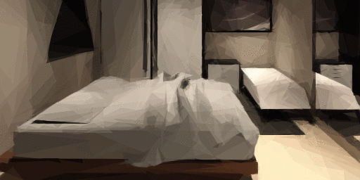
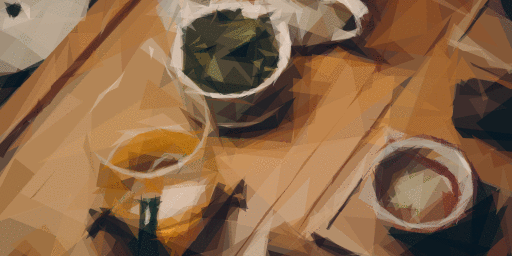
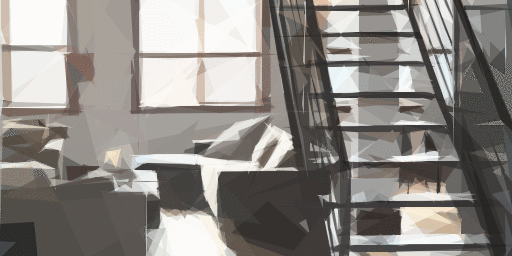
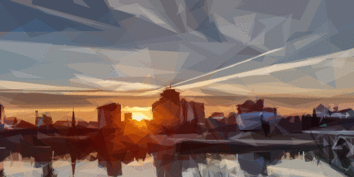

# [The Last Game Designer](/chapter-one)

By Starving Indie ([@gamewritr](http://twitter.com/gamewritr))

## [Chapter One]("Window's Closing")
Your purpose in life has always been to make games and share them with the world, but your internet allowance is running out. 

**You're down to two minutes of internet allowance.**

When you run out of internet allowance, internet access is revoked [forever.](/chapter-two)

## [Chapter Two]("Location: Apartment")

On your last minute of internet, **you** get a choice: Keep your computer without ever being able to access internet, or trade-in your computer for one last upload. 

**If you trade-in your computer, you're allowed to upload one last thing before it's taken away forever. If you keep your computer, you're NOT allowed to upload anything on your last minute of internet use.**

[Everyone gets that same deal.](/chapter-two-part-two)

## [Chapter Two Part Two]("Location: Apartment")

Internet access is granted at 6:30am. You've been coding all night, but time is running out. You have to upload your game in under a minute. This gives you one minute to upload another tomorrow, if you choose to. 

No room for error. 

What kind of game did you make?

- [A game about wisdom.](/chapter-three#wisdom)
- [A game about justice.](/chapter-three#justice)
- [A game about truth.](/chapter-three#truth)

## [Chapter Three]("Location: Apartment")
*[Your game will be philosophical.](?wisdom)[Your game will be empathetic.](?justice)[Your game will be honest.](?truth)*

[You worked hard to create a game about how action is more important than words.](?wisdom)[You worked hard to create a game about the importance of upholding justice for everyone.](?justice)[You worked hard to create a game about how truth is only bad if we interpret it as such.](?truth) Still, you're afraid the message might get lost.

After 10 years of this craft, have your games ever cut through the noise of the internet?

- ["Someone's life has hopefully been improved by my games."](/chapter-four#joy)
- ["What truly matters is contributing positive work."](/chapter-four#control)
- ["I make these games for myself, not the world."](/chapter-four#me)

## [Chapter Four]("Location: Apartment")
*[Your game will be theraputic.](?me)[Your game will be forgiving.](?control)[Your game will be joyful.](?joy)*

[In a world where everyone is yelling and no one is listening, game design keeps your mind still and at peace.](?me)[In a world where you control little, putting good intentions into your work is something that is still in your control.](?control)[Games are nothing if not a means to bring joy to others.](?joy)

The time has come. Releasing your game feels like putting a message in a bottle and throwing it into the universe. 

[Who knows if anyone will ever see it.](/chapter-four-part-two)

## [Chapter Four Part Two]("Location: Apartment")
**Wait...Something went wrong.** The game didn't upload. You logout of the internet in order to conserve your last minute. 

Unbelievable. 

All that hard work and the game didn't upload in time.

- [Shrug it off. Life happens.](/chapter-four-part-three#shrug)
- [Cry.](/chapter-four-part-three#cry) 
- [Meditate.](/chapter-four-part-three#meditate) 

## [Chapter Four Part Three]("Location: Apartment")
*[Your next game will have passion.](?cry)[Your next game will be calm.](?meditate)[Your next game will be pragmatic.](?shrug)*

[You know crying won't change what happened, but the tears need to flow before you can move forward. You give yourself a few minutes.](?cry)[You feel strong emotions cloud your thoughts. You immediately close your eyes and try to be grateful for your breath. It's a challenge.](?meditate)[Another event outside your control. The best course of action is to have a short memory and move on.](?shrug)

Tomorrow you'll only have one minute to upload your last game. There's little time to dwell. Work needs to [start now.](/chapter-five)

## [Chapter Five]("Location: Apartment")
After the failed upload you need counsel from a friend. You can go to the Tea Garden to see your best friend or you can visit your mentor at his house. Who will you visit?

- [Your life-long mentor. He'll give you advice on making something for the world.](/craig)
- [Your closest friend. She'll give you advice on making something for yourself.](/lucy)

<!--FRIEND BRANCH-->
## [lucy]("Location: The Tea House")

You sit with your life-long friend and have a chat over hot tea. She reminds you that your purpose is to make games regardless of who plays them. You'll regret giving up making games, just to release one to the world.

- ["I agree".](/lucy-two#lucy-advice)
- ["I disagree"](/lucy-two#independence)
- ["I'll have to think about it more."](/lucy-two#fun)

## [Lucy Two]("Location: The Tea House")

*[Themes of wisdom will show up in your next game.](?lucy-advice)[Your next game will have an idependent feel.](?independence)[Your next game will be light-hearted and spontaneous.](?fun)*

[You tell your friend you agree. You always made games for the love of the work.](?lucy-advice)[You tell her that you've made up your mind on what you'll do, you just need someone to support you. She smiles with understanding.](?independence)[She smiles and pours you some more tea. For an hour you guys laugh and swap stories of the old times.](?fun)

When it's time to go, she tells you she's going to miss your contributions. "The world needs more positivity and understanding. It's possible you may be the last game designer."

You tell her:

- ["I'll keep making games, whether the world sees them or not."](/chapter-six)
- ["I'm grateful to have been given the opportunity to share what I love."](/chapter-six)

<!--END FRIEND BRANCH-->

<!-- Mentor Branch-->
## [craig]("Location: Your Mentor's House")

Your mentor greets you with a hug and a warm smile. He reminds you that your purpose is to make games for the people. Choosing to keep the laptop and continue making games for yourself will, over time, feel empty.

- ["I agree".](/craig-two#craig-advice)
- ["I disagree"](/craig-two#independence)
- ["I'll have to think about it more."](/craig-two#fun)

## [Craig Two]("Location: Your Mentor's House")

*[Themes of wisdom will show up in your next game.](?craig-advice)[Your next game will have an idependent feel.](?independence)[Your next game will be light-hearted and spontaneous.](?fun)*

[You tell your mentor you agree, your games were always meant to be a contribution for a better world.](?craig-advice)[You tell your mentor that you've made up your mind on what you'll do, you just need someone to support you. He smiles with understanding.](?independence)[He smiles and puts his hands up in surrender. For an hour you guys laugh and swap stories of the old times.](?fun)

When it's time to go, he tells you he's going to miss your contributions. "The world needs more positivity and understanding. It's possible you may be the last game designer."

You tell him:

- ["I'll keep making games, whether the world sees them or not."](/chapter-six)
- ["I'm grateful to have been given the opportunity to share what I love."](/chapter-six)

<!--END MENTOR BRANCH-->

## [Chapter Six]("Location: Apartment")

You arrive back home. Being out took a while, but you're now ready to work on your final game. You have a minute to upload your game tomorrow. It'll have to be a tiny game. 

What kind of game will you make?

- [8-bit arcade style](/chapter-seven#eight-bit)
- [Text only narrative game](/chapter-seven#if)
- [Optimized 64-bit 3D game](/chapter-seven#three-d)

## [Chapter Seven]("Location: Apartment")

You spend all night coding [a homage to the early days of games. Pixel art and everything.](?eight-bit)[an interactive fiction game with a strong story.](?if)[a throwback to the 64-bit days.](?three-d) 

This is the last game you'll ever release, but if you choose not to upload the project you can keep making games. These thoughts are distractions as you put the finishing touches on your game. 

Does the world need one last game from you?

[Time to upload](/chapter-eight)

## [Chapter Eight]("Location: Apartment")

As the sun rises in the city, you **click the release button**. The final decision begins to rest on your conscious. Will you: 

- [Cancel the upload and begin an era of making games for yourself?](/the-end#cancel)
- [Finish the upload and walk away from the craft forever.](/the-end#upload)

## [The End]("Location: Apartment")
[You smash the cancel button. Making games is who you are. You would never be able to give that up, even if no one ever saw your work. You sigh with relief. This was the right decision. A life of doing what you love is all you've ever wanted.](?cancel)[You let the upload finish. This is the last game you'll ever put out into the world. You're beyond proud of the work and you hope it improves the life of at least one person.](?upload)

[You give your small game another quick playthrough.](/the-end-two)

## [The End Two]("Location: Apartment")
The game is everything you ever wanted it to be.[It's a charming 8-bit game with beautiful, melodic chiptunes.](?eight-bit)[It's an interactive fiction game for the ages. It tells a story so gripping, you find yourself lost in its world.](?if)[The primitive 3D graphics reminds you of your childhood and what made you fall in love with games in the first place.](?three-d)[ It's filled with wisdom and insight that is sure to fill you with lasting life truths.](?craig-advice)[ The game feels edgey in an independent way. It has a strong clear message that it doesn't shy away from.](?independence)[ It's a blast to play. The beautiful visual design and thoughtful mechanics brings a smile to your face.](?fun)

[Throughout the game, there are themes of pragmatism, self control and discipline.](?wisdom)[Throughout the game, there are themes of being kind to one another and fighting for the little guy.](?justice)[ Throughout the game, there are themes of truth that speak to our humanity.](?truth) [Your game has elements that dive deep into your soul and extract happiness.](?joy)[ Your game helps the player understand what is not in their control and accept what is.](?control)[ The finished game helps heal your own wounds and makes you feel whole again.](?me)

[There are some bugs, but you see them adding a charm to the final game. A sort of harmonious imperfection.](?shrug)[ There's a calming effect that arises from the gameplay.](?meditate)[ Your past tears deliver a firey passion that is felt in every mechanic.](?cry)

[Your mentor had good intentions, but you had to follow your own path.](?cancel&craig-advice)[ You're happy you followed your mentor's advice. He steered you in the right direction](?upload&craig-advice)[Your friend had good intentions, but you had to follow your own path.](?upload&lucy-advice)[ You're happy you followed your friend's advice. She steered you in the right direction](?cancel&lucy-advice) **In the end, you know in your heart you've made the right call [to continue doing the one thing you love more than anything else.](?cancel)[to put the best piece of yourself out into the world.](?upload)**

<!--IMAGE REFERENCE-->
## images

