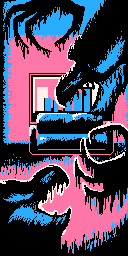
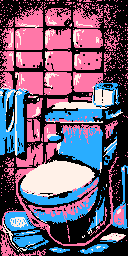

# [THE SQUIDBAGS PRESENT](/scene-one)

## SCENE ONE
Your dream date is waiting! You're late! And of course, the demons in your apartment are keeping you from leaving the apartment. Not again! They're occupying more and more space. It's been years, since you've been on a date... you'll be damned if you miss it.

- [Get rid of the Demons](/scene-two)
- [Appeal to the Demons](/scene-two-alternate#mochi)

## SCENE TWO

Yeah, these demons and ghouls need to go. The last time they invaded your house you used a magical Source Key to get them to leave. You quickly scan your room, but it's a mess. It's cluttered with a bunch of figurines and video games. You can't remember where you left that Source Key!

- [Look for the source key](/scene-three)
- [Craft a brand new Source Key](/scene-three-alternate)

## SCENE THREE
You go in search for the Source Key. Ugh! This apartment is a mess. It's becoming difficult to even move around with all the clutter. The demons know you're searching for the Source Key. 

Suddenly, your teleported into the bathroom. The door locks behind you. Just great!

- [Break off the door knob!](/scene-four)
- [Search for a way out](/scene-four-alternate)

## SCENE FOUR

As you reach for the door, you hear a demonic voice from behind you. It sounds just like you. You turn to see an enraged bathroom mirror trying to hypnotize you into its black infinite abyss... You try to resist, but the mirror's hypnotizing voice is so soothing....

- [Smash the bathroom mirror](/scene-five)

## SCENE FIVE

You wrap a towel around your hand and punch the bathroom mirror as hard as you can! SMASH! Shards of the mirror fall to the ground... but suddenly they start to float upwards. Crap. The Evil Mirror Shards look like they're going to attack with lightning speed!

- [Try to dodge the shards](/death-one)
- [Use the mirror against itself](/scene-six)

## DEATH ONE

You try to dodge all the shards, but it's useless. They all fly at you too fast and pin you to the wall and skewer you.

- [RESTART FROM CHECKPOINT](/scene-five)

## SCENE SIX

You capture one of the shards out of the air and reflect it back at the mirror. The mirror becomes so confused that it begins to implode... BUT, in it's existential break down, it's trying to suck you into it's black reflective void.

- [Hold on to something tight!](/death-two)
- [Reach for the door knob!](/death-three)
- [Flood the bathroom!](/scene-seven)

## DEATH TWO

You hold on to the toilet in the hopes of not getting sucked in, but the void is too strong. It sucks you and the toilet into it.

This is absolutely the worst way to die... with a toilet.

- [RESTART FROM CHECKPOINT](/scene-five)

## DEATH THREE

You try to hold on to the door handle, but the door is obviously a demon and chomps you in half. Your other half gets sucked into the void.

- [RESTART FROM CHECKPOINT](/scene-five)

## SCENE SEVEN

As you're being sucked into the void, you lift the toilet seat up, turn on all the faucets and the shower. For a brief moment you're sucked into the void with all the water, but then the mirror coughs you out as it drowns on all the water it's inhaling.

- [>](/prize-one)

## PRIZE ONE
In the chaos of a flooded bathroom you found a drain pipe!!

You can now use this item... With the Evil Mirror defeated, you escape the bathroom.

- [>](/scene-eight)

## SCENE EIGHT

	

Now that you've escaped the bathroom, it's time to search for the Source Key. 

As you search the living room, your junk rapidly begins to close in on you. Your running out of space to move and the strong walls are closing. Panic sets in as you figure out what to do...

- [Try to push the walls apart](/death-four)
- [Quickly get rid of your stuff](/scene-nine)

## DEATH FOUR

You try to keep the walls from closing in by prying them open, but they're way to strong. You're slowly squished until you pop like a grape.

- [RESTART FROM CHECKPOINT](/scene-eight)

## SCENE NINE

	

You gather up the clutter around your living room and look for a place to chuck it... The window! But as you go to throw your junk out, the window snaps shut and locks itself. The window has always been so damn stubborn! This is it, you're going to drown in your own junk!

- [Quick! Look for the Source Key!](/death-five)
- [Try to unlock the window](/death-six)

## DEATH FIVE

You frantically look for the Source Key in a race against the clock, but there's too much stuff to sift through and it looks like all your junk is now multiplying. You're squished to death under the weight of your own apartment objects.

- [RESTART FROM CHECKPOINT](/scene-eight)

## DEATH SIX

You try to unlock the window, but the window is as stubborn as you remember. The window just laughs at you as you're drowned to death under the weight of your own clutter.

- [RESTART FROM CHECKPOINT](/scene-eight)

## SCENE TEN

	

GREAT THINKING! You smash the window open with the drain pipe! Immediately you start throwing things out onto the street until you finally find the Source Key! 

- [>](/prize-two)

## PRIZE TWO

You gained the source key!

- [>](/scene-eleven)

## SCENE ELEVEN

	

	

Now that you have the Source Key, it's time to defeat these damn demons! As you approach them with the Source Key, they keep their distance, but they laugh. They've grown stronger since the last time you've had to deal with them. Much much stronger.

- [Find a deadly weapon](/scene-twelve)

## DEATH SEVEN

You try to fight them with your drain pipe, but I wasn't kidding when I said they've grown much stronger. They rip you up into little tiny pieces.

- [RESTART FROM CHECKPOINT](/scene-eleven)

## SCENE TWELVE

	

	

That's right! You remember there's a sword under your bed. If you can attach the Source Key with the sword, not only can you keep the demons at bay, but you can hack them up too! Only problem, is a hoard of Demons stands between you and your bedroom.

- [Try to climb over the demons](/death-eight)
- [Try to reason with the demons](/death-nine)

## DEATH EIGHT

You try to climb over the demons, but your attempt turns into a violent version of crowd surfing. The demons have a frenzy gnawing you to pieces.

- [RESTART FROM CHECKPOINT](/scene-eleven)

## DEATH NINE

You try to reason with demons, but they just laugh at you and then proceed to rip you to shreds. Demons are not to be reasoned with!

- [RESTART FROM CHECKPOINT](/scene-eleven)

## SCENE THIRTEEN

	

	

GREAT THINKING! The Demons aren't harmed by the Source Key, but they're still keeping their distance. 

You use the source key to carve a path through the demons to your bedroom. As soon as you find your sword, you waist no time slashing the demons into bits.

- [>](/prize-three)

## PRIZE THREE

You've earned a sword!!

- [>](/scene-fourteen)

## SCENE FOURTEEN

	

	

	

You're almost there!!

With the Demons taken care of, you rush for the door hoping to make it to your date on time. As you go to leave your apartment, the front door turns into a large mouth that looks like there isn't enough food in this world to satisfy its hunger!

- [Try feeding it random objects](/death-ten)
- [Look for an opening to get passed it](/scene-fifteen)

## DEATH TEN

You try to feed the door random objects in the house, but it only gets more and more hungry until finally it devours you alive! It is true, nothing in this universe can satisfy its hunger!

- [RESTART FROM CHECKPOINT](/scene-fourteen)

## SCENE FIFTEEN

	

	

	

You study the Door Monster carefully as you dodge its chomps. It's just a door, if you can reach the door knob, you should just be able to walk right out- but as soon as you do, it immediately locks itself! "Hahaha how will you get passed a locked door?!"

## DEATH ELEVEN

You try to use your drain pipe to break off the dead bolt, but it ends up breaking the drain pipe instead. The door laughs as it chomps you up in one bite!

- [RESTART FROM CHECKPOINT](/scene-fourteen)

## DEATH TWELVE

You try to stab the door with your sword, but it just devours you in one bite.

- [RESTART FROM CHECKPOINT](/scene-fourteen)

## SCENE SIXTEEN

GREAT THINKING! It suddenly occurs to you, why not just unlock the door? You stick the Source Key into the Door Monster's Lock and turn the key. The monster is defeated and your whole apartment turns back to normal.

You exit your apartment, lock the door behind you and head off to meet your date.

CONGRATULATIONS YOU'VE ACHIEVED ONE OF FOUR ENDINGS!

<!--

******************* BRANCH TWO STARTS HERE ******************
-->

## SCENE TWO ALTERNATE

You decide that it's probably better to get on the demons good side. Unfortunately, sweet talking them into letting you go on a date doesn't work. They're still pissed about when you tried to get rid of them the last time they haunted your apartment.

- [You offer them a gift](/chapter-two-three)

## CHAPTER TWO-THREE

A brilliant idea hits you! What do Demons love more than anything else? Souls! If you can just find your cat, Mochi, you can offer her soul up to the Demons and then they'll forgive you. Right?! Cats have nine souls anyways... or is it lives? Same difference.

- [You go in search for Mochi](/chapter-two-four)

## CHAPTER TWO-FOUR

You go looking for your cat. To your horror, you catch a glimpse of Mochi just as she's being eaten by your stinky and decaying Zombie Couch. Of course! It's going to take forever to get Mochi out of that damn Zombie Couch.

- ["This is not how I thought tonight would go..."](/scene-seventeen)

## SCENE SEVENTEEN

Ok! Time to defeat the Zombie Couch. As you get closer you start to lose motivation. You're becoming lazier and lazier. OH NO!! The Zombie Couch has cast some weird spell on you! Suddenly you receive a buzzing message.

- [Check your phone](/scene-eighteen)
- [Take a quick nap](/death-thirteen)

## DEATH THIRTEEN

A little power nap won't hurt right? WRONG! That is the last nap you ever take. You do not wake up.

- [RESTART FROM CHECKPOINT](/scene-seventeen)

## SCENE EIGHTEEN

It's from your date! They're not going to want to be involved with a Couch Potato. Through sheer desire, you snap out of your trance. As you do, the Couch opens up and wraps it's slimy tongue around you. It's strength is crazy! It's pulling you into the cushions.

- [Grab a sharp object](/scene-nineteen)
- [Pry yourself open](/death-fourteen)

## DEATH FOURTEEN

I wasn't kidding when I said it's strength is crazy! As you try to pry yourself free, it tightens its grip on you. You suffucate to death.

- [RESTART FROM CHECKPOINT](/scene-seventeen)

## SCENE NINETEEN

As you're about to be swallowed whole, you yank out a spring from inside the Zombie Couch's mouth and use it to slice off it's tongue! The Zombie Couch releases its grip on you and spits out Mochi! Success! Mochi pops out and runs away as your couch dies.

- [>](/prize-four)

## PRIZE FOUR

	
	
	
	
	

DAMN! There was a lot of stuff in that couch!
You've found a drain pipe, a key, a sword, a $5 bill and a lazer pointer in the Couch Cushions. YAY!!

- [>](/scene-twenty)

## SCENE TWENTY

	

	

	

	

	

Now that the Couch is dead, time to catch Mochi so you can trade her soul for romance. However she's does not seem ok with this deal. She's morphing into a ravenous monster. You're not going to trade her soul without a fight.

- [Quick! Get the catnip!](/scene-twenty-one)
- [Try to calm Mochi with pets](/death-fifteen)

## DEATH FIFTEEN

As soon as you try to pet her, she hisses... she came here to fight! She scratches up your face bad. There's no way you can go on a date looking like this!

- [RESTART FROM CHECKPOINT](/scene-twenty)

## SCENE TWENTY-ONE

	

	

	

	

	

Mochi is growing bigger and bigger! If you can just get to the catnip in the kitchen, you should be able to knock her out. But Mochi is blocking the way... and she's looking like she wants to scratch your eyeballs out.

- [Fight Mochi](/death-sixteen)
- [Push past Mochi](/death-seventeen)

## DEATH SIXTEEN

You attempt to fight Mochi, but she hurls fur balls at you and proceeds to scratch up your entire face. There's no way you can go on a date looking like this!

- [RESTART FROM CHECKPOINT](/scene-twenty)

## DEATH SEVENTEEN

Mochi isn't having it! She grows so large and starts to hurl fur balls at you, while scratching up your entire face. There's no way you can go on a date looking like this!

- [RESTART FROM CHECKPOINT](/scene-twenty)

## SCENE TWENTY-TWO

	

	

	

	

	

GREAT THINKING! You use the lazer pointer to distract Mochi. She frantically chases after the shiny red dot as you snatch up the catnip. Once you have it, you throw the catnip all over the floor. Mochi loses interest in the dot and proceeds to roll around in the nip.

- [>](/prize-five)

## PRIZE FIVE

Mochi shrunk back down! You now have a cat soul to trade!

- [>](/scene-twenty-three)

## SCENE TWENTY-THREE

	

	

	

	

	

With Mochi in hand, you try to offer the demons her soul as a "sorry gift", but Demons are mad that you killed the Zombie Couch. That was one their own, after all.

- [Bargain with the Demons](/scene-twenty-four)
- [Tell them to suck it up](/death-seventeen)

## DEATH SEVENTEEN

This does not go over well with the Demons. They, in return, keep you from leaving the apartment to go on your date, all the while tell YOU to suck it up.

- [RESTART FROM CHECKPOINT](/scene-twenty-three)

## SCENE TWENTY-FOUR

	

	

	

	

	

You try to bargain with them, but they don't know what else you could possibly provide them that they'd want. A cat's soul is not enough. You gotta sweeten the pot.

- [Offer them your own soul](/death-eighteen)

## DEATH EIGHTEEN

Unwise! You offer up your own soul and the demons take it immediately. Within seconds you drop to the floor with a lifeless gaze. I don't think you'll be making your date tonight.

- [RESTART FROM CHECKPOINT](/scene-twenty-three)

## DEATH NINETEEN

You hand over the lazer pointer you pulled from the Zombie Couch. The Demons give you a look like, "What are we supposed to do with this?" They're offeneded and determined not let you go on your date.

- [RESTART FROM CHECKPOINT](/scene-twenty-three)

## SCENE TWENTY-FIVE

	

	

	

	

GREAT THINKING! 

You offer the Demons the $5 bill you found in the couch. They're quick to snatch it from your hands and take Mochi's soul. The Demons forgive you and tell you they won't bother you anymore, but they can't say the same for the other haunted things in your house.

[>](/scene-fourteen)

<!--

***************************** BRANCH THREE STARTS HERE ************
-->

## SCENE THREE ALTERNATE

This apartment is so cluttered, who knows where the key could be. Maybe it's better to just craft the Source Key instead of go looking for it. As you head to the kitchen to grab the ingredients, it goes up in a blaze of fire. An angry Kitchen Devil (a coffee maker) appears.

- [Defeat the Kitchen Devil](/chapter-three-four)

## CHAPTER THREE-FOUR
You go to unplug the annoying Kitchen Devil, but as you get closer the fire gets hotter and hotter! You have to keep your distance or else you'll sure melt into a pile of molten, human ash. If only you could put out the fire...

- [Search for water in the bathroom](/scene-twenty-six)

## SCENE TWENTY-SIX

You go to the bathroom in search of water, but when you turn on the faucet a bunch of Demon Slugs slither out. GROSS! They're poisonous and are making their way towards you. They have to have a weakness of some kind...

- [Probably fire](/scene-twenty-seven)
- [Pick them up and flush them in the toilet](/death-twenty)

## DEATH TWENTY

What did I just say!? They're poisonous! You pick them up with your bare hands and immediately break out in hives and boils. There's no way you can go on a date looking like this!

- [RESTART FROM CHECKPOINT](/scene-twenty-six)

## SCENE TWENTY-SEVEN

You race back to the living room and grab a shirt. You wrap it around your remote and light it on fire using the flames from the kitchen. When you turn around the whole apartment is infested with these poisenous slugs. Ugh! Leaving the faucet running is a bad habit.

- [Burn this baby down!](/scene-twenty-eight)
- [Try to run through them](/death-twenty-one)

## DEATH TWENTY-ONE

Yeah, that's not gonna work. You see, like I said, these are poisonous slugs. They quickly swarm you and cover your body. You immediately break out in hives and boils. There's no way you can go on a date looking like this!

- [RESTART FROM CHECKPOINT](/scene-twenty-six)

## SCENE TWENTY EIGHT

You light your whole apartment on fire. Not exactly solving the problem, but it's some progress. With the slugs burning to death, you go to the bathroom and rip out the toilet, causing a massive flood in your apartment.

- [>](/prize-six)

## PRIZE SIX

	
	
	

You found an empty bottle in your medicine cabinet, a Drain Pipe and a Soap Bar! Yay!

- [>](/scene-twenty-nine)

## SCENE TWENTY-NINE

	

	

	

You head back to the kitchen, but the you discover the flood was not enough to kill the Kitchen Devil Coffee Maker! He laughs at you, as he continues to burn down your kitchen. Jerk! If there was only a way to throw water on him!

## SCENE THIRTY

	

	

	

GREAT THINKING! 

You fill your empty bottle with toilet water and throw it at the Coffee Maker. The gross toilet water immediately nullifies him! Now you just need to remember how to mold a Source Key...

## DEATH TWENTY-TWO

You drink the toilet water. I don't know why, but you do. And then immediately you feel sick to your stomach. There's no way you're going to make your date now.

- [RESTART FROM CHECKPOINT](/scene-twenty-six)

## DEATH TWENTY-THREE

You waist away hours trying to figure out how to turn a drain pipe into a key. Yeah, that didn't work and you missed your date.

- [RESTART FROM CHECKPOINT](/scene-twenty-six)

## DEATH TWENTY-FOUR

You throw your drain pipe at the Kitchen Devil Coffee Maker! It's not effective. At all. The Kitchen Devil laughs at you before burning your apartment to the ground. At least you have insurance...

- [RESTART FROM CHECKPOINT](/scene-twenty-six)

## SCENE THIRTY ONE

	

GREAT THINKING! You use the soap bar and some utensils from the kitchen to craft another Source Key!

- [>](/prize-two)

<!--

***************************** BRANCH FOUR STARTS HERE ************
-->

## SCENE FOUR ALTERNATE

You begin searching for a way out of the bathroom, when suddenly the walls begin to close in all around you. They're caving in fast! The shower nozel springs to life and begins to wrap itself around your neck!

- ["Can't Breath!"](/scene-thirty-two)

## SCENE-THIRTY-TWO

You try to break free from the strangling shower hose, but the more you struggle the more it tightens around your neck. You feel the breath leave your body slowly...

- [Find something sharp to break free](/scene-thirty-three)
- [Try to pry yourself free](/death-twenty-five)

## DEATH TWENTY FIVE

You try to pry yourself free... Not a good idea. Like I said, the more you struggle, the more it tightens the cord tightens around your neck. It isn't long before you drift off into a deep long sleep.

- [RESTART FROM CHECKPOINT](/scene-thirty-two)

## SCENE-THIRTY-THREE

You try to reach for the mirror so you can break it and use the glass shards to escape the death grip. Unfortunately, the shower hose pulls you into the bathtub like forceful vines. Your hands streak across your window as you take your final breath...

- [Break the window](/scene-thirty-four)
- [Turn on the shower water](/death-twenty-six)

## DEATH TWENTY SIX

You reach for the shower knob and turn on the water. Not good. The water is now flowing through the cord, making it harder to breath. The bath tub fills up with water. The shower hose pulls you deeper and deeper into the infinite abyss...

- [RESTART FROM CHECKPOINT](/scene-thirty-two)

## SCENE-THIRTY-FOUR

You smash the window, use a glass shard to cut yourself free from cord. You escape through the window and scale the side of your apartment until you enter through your living room window.

- [>](/prize-last)

## PRIZE LAST

In the chaos of a bathroom struggle you found a drain pipe!!

- [>](/scene-eight)
